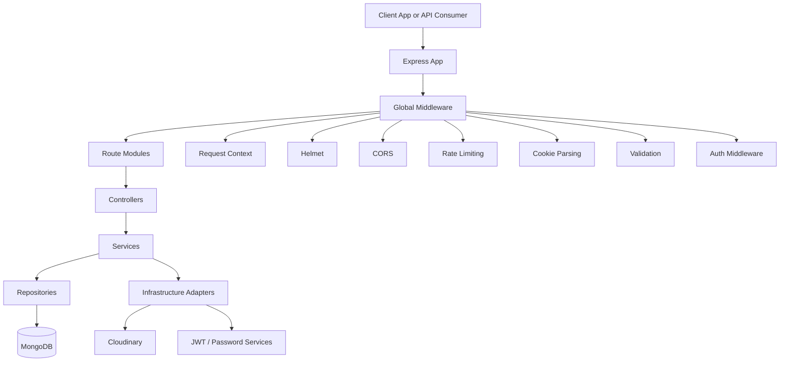
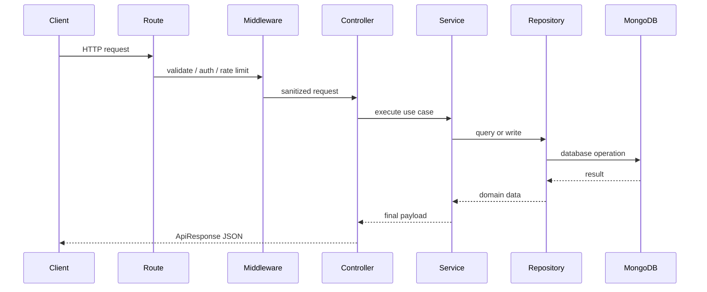
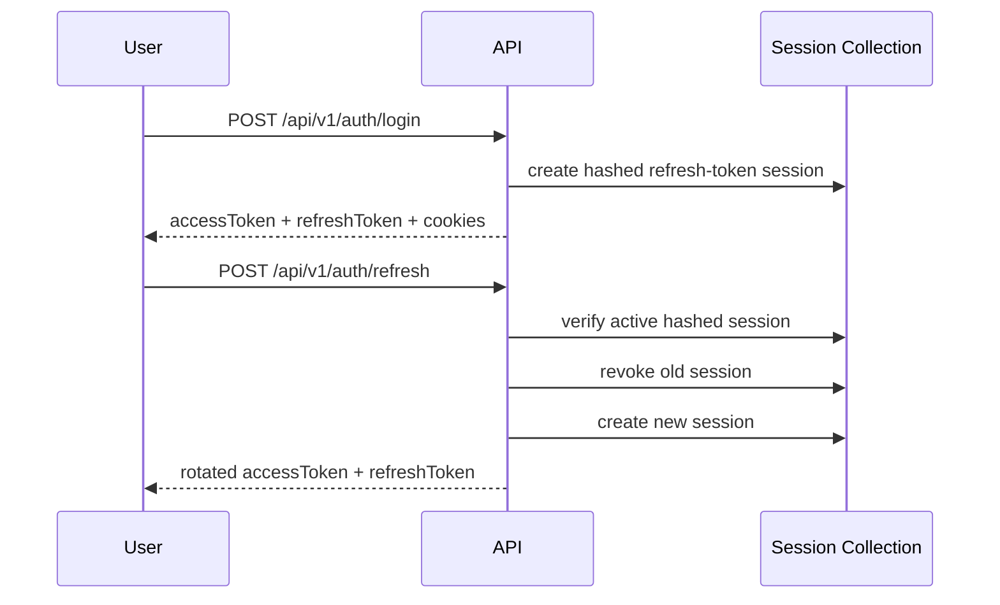
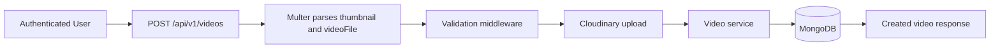
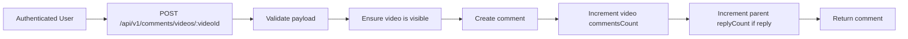

# Streamly Backend

Production-oriented backend for a video platform, built as a modular monolith with Node.js, Express, MongoDB, Cloudinary, and OpenAPI-powered docs via Scalar.

## Overview

Streamly is structured to look like an actual backend service, not a tutorial app. It separates HTTP handling, business logic, persistence, infrastructure integrations, and shared middleware so features can grow without collapsing into controller-heavy code.

It currently supports:

- JWT-based auth with session-backed refresh token rotation
- user account management and channel profile lookup
- video publishing with visibility and status controls
- subscriptions
- comments and replies
- reactions on videos and comments
- health probes, rate limiting, security headers, structured logging
- OpenAPI JSON and interactive API docs

## Architecture

### System View



### Request Lifecycle



### Auth and Session Rotation



## Project Structure

```text
src/
  app/              # app bootstrap, route mounting, server startup
  config/           # env, DB, CORS, OpenAPI config
  infrastructure/   # Cloudinary and auth helpers
  lib/              # logger, ApiError, ApiResponse, async wrapper
  middlewares/      # auth, validation, rate limiting, error handling, uploads
  models/           # Mongoose models
  modules/          # feature modules
    auth/
    users/
    channels/
    videos/
    subscriptions/
    comments/
    reactions/
    health/
    docs/
  utils/            # cookie helpers
```

Each feature module follows the same pattern:

```text
module/
  *.routes.js
  *.controller.js
  *.service.js
  *.repository.js
  *.schema.js
```

## Core Capabilities

### Authentication

- register with avatar and optional cover image upload
- login with email or username
- refresh access using session-backed refresh tokens
- logout and revoke current refresh session
- issue auth cookies in addition to JSON tokens

### Users and Channels

- fetch current user profile
- update account details
- change password
- update avatar
- update cover image
- fetch public channel profile by username

### Videos

- create video with thumbnail and media upload
- list published videos with pagination and filtering
- fetch a single video with visibility checks
- update owned videos
- delete owned videos
- support `draft`, `published`, `archived`
- support `public`, `private`, `unlisted`

### Social Features

- subscribe and unsubscribe to channels
- list current user subscriptions
- add comments and replies
- update or delete owned comments
- react to videos and comments

### Operational Features

- liveness and readiness probes
- global API rate limiting and stricter auth rate limiting
- `helmet` security headers
- request IDs and structured request logging
- OpenAPI 3.1 spec at `/openapi.json`
- interactive Scalar docs at `/docs`

## API Surface

| Area | Endpoints |
| --- | --- |
| Health | `GET /health/live`, `GET /health/ready` |
| Docs | `GET /openapi.json`, `GET /docs` |
| Auth | `POST /api/v1/auth/register`, `POST /api/v1/auth/login`, `POST /api/v1/auth/refresh`, `POST /api/v1/auth/logout` |
| Users | `GET /api/v1/users/me`, `PATCH /api/v1/users/me`, `PATCH /api/v1/users/me/password`, `PATCH /api/v1/users/me/avatar`, `PATCH /api/v1/users/me/cover-image` |
| Channels | `GET /api/v1/channels/:username` |
| Videos | `GET /api/v1/videos`, `GET /api/v1/videos/:videoId`, `POST /api/v1/videos`, `PATCH /api/v1/videos/:videoId`, `DELETE /api/v1/videos/:videoId` |
| Subscriptions | `GET /api/v1/subscriptions/me`, `POST /api/v1/subscriptions/channels/:channelId`, `DELETE /api/v1/subscriptions/channels/:channelId` |
| Comments | `GET /api/v1/comments/videos/:videoId`, `POST /api/v1/comments/videos/:videoId`, `PATCH /api/v1/comments/:commentId`, `DELETE /api/v1/comments/:commentId` |
| Reactions | `POST /api/v1/reactions/:targetType/:targetId`, `DELETE /api/v1/reactions/:targetType/:targetId` |

## Quick Start

### 1. Install dependencies

```bash
npm install
```

### 2. Create environment file

```bash
cp .env.example .env
```

### 3. Fill required values

| Variable | Required | Purpose |
| --- | --- | --- |
| `NODE_ENV` | no | Runtime mode, defaults to `development` |
| `PORT` | no | HTTP port, defaults to `8000` |
| `APP_URL` | no | Base URL used in OpenAPI server metadata |
| `CORS_ORIGIN` | no | Allowed frontend origin list, comma-separated |
| `MONGODB_URI` | yes | MongoDB connection string without DB suffix |
| `ACCESS_TOKEN_SECRET` | yes | JWT secret for access tokens |
| `ACCESS_TOKEN_EXPIRY` | yes | Access token TTL |
| `REFRESH_TOKEN_SECRET` | yes | JWT secret for refresh tokens |
| `REFRESH_TOKEN_EXPIRY` | yes | Refresh token TTL |
| `CLOUDINARY_CLOUD_NAME` | yes | Cloudinary account name |
| `CLOUDINARY_API_KEY` | yes | Cloudinary API key |
| `CLOUDINARY_API_SECRET` | yes | Cloudinary API secret |
| `RATE_LIMIT_WINDOW_MS` | no | Global rate-limit window |
| `RATE_LIMIT_MAX_REQUESTS` | no | Global rate-limit cap |

The checked-in example file is [`.env.example`](/home/sarthak/dev/Streamly-backend/.env.example).

### 4. Start MongoDB

Use a local MongoDB instance or MongoDB Atlas. The server appends the database name internally during connection.

### 5. Start the API

```bash
npm run dev
```

For a non-watch process:

```bash
npm start
```

## Runbook

### Health Checks

```bash
curl http://localhost:8000/health/live
curl http://localhost:8000/health/ready
```

### API Docs

- Scalar UI: `http://localhost:8000/docs`
- OpenAPI JSON: `http://localhost:8000/openapi.json`

### Example Smoke Test

```bash
curl http://localhost:8000/openapi.json
```

## Example Flows

### Create a Video



### Comment on a Video



## Tooling

- runtime: Node.js + Express
- database: MongoDB + Mongoose
- media storage: Cloudinary
- file ingestion: Multer
- auth: JWT + bcrypt
- docs: OpenAPI 3.1 + Scalar
- development: nodemon, Prettier

## Notes and Limitations

- there is no committed automated test suite yet, even though `npm test` is defined
- media uploads require valid Cloudinary credentials at startup
- readiness depends on active MongoDB connectivity
- this service is organized as a modular monolith, not a microservice system

## Why This README Exists

This repository is positioned like a production-style backend project. The documentation should make architecture, setup, and API usage obvious within a few minutes. That is the standard this `README` now targets.
